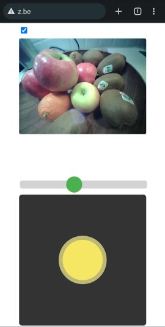

# ESP32-CAM_ZeppelinCAM
ESP32CAM: Control motors and servo and stream video of a mini Blimp/Zeppelin to your browser using ESP32CAM or XIAO ESP32S3 Sense. The motors are controlled by one slider and one joystick.

## Communication
- WifiPoint / SoftAP
- SSID = BlimpCam- + 4 last hexadecimal values of the Wifi-MAC address of the ESP32 chip
- Wifi-password: 12345678
- App: browser (Chrome, Firefox, safari, ...)
- URL : http://192.168.4.1 of http://z.be

## Browser User interface 

- Check box: switch on camera (default off, so that zeppelin can still be controlled in case of low battery)
- camera view
- slider: control up motor
- Joystick: controls
  - left/right: servo and/or h-bridge
  - up: forward motor. Remark only the upper part is used, the zeppelin can only move forward (not backward)

## Hardware
It has been developped and tested on following platforms, but it is easy to adapt for other chips:
- AI-Thinker ESP32CAM
- XIAO ESP32S3 Sense

Motors
- 1 motor to go up (1-directional)
- 1 motor to go forward (1-directional)
- To turn you can choose between
  - a motor using h-bridge (2-directional) and/or
  - a servo

Shopping list used in ESP32-S3 setup:
- motors: 4 * 8mm Coreless DC Motor : https://www.aliexpress.com/item/32871146089.html
- h-bridge : DRV8833 : https://www.aliexpress.com/item/4000051647999.html
- Propellors : 30mm For 0.7mm shaft Tail Rotor Spare Parts Propellers : https://www.aliexpress.com/item/4000108963651.html
- battery: https://www.aliexpress.com/item/1005001860198745.html
- connector for battery: JST 1.25mm 2 Pin Micro Connector: https://www.aliexpress.com/item/33027366342.html
- balloon: https://www.ballonsupermarkt-onlineshop.de/folienballons/folienballons-ungefullt/luftballons-aus-folie-grosse-buchstaben-100-cm/buchstaben-luftballons-aus-folie-silber-100-cm.html

The parts for ESP32CAM are similar, but remark that powering the ESP32CAM is more difficult.

## Pin allocation ESP32CAM and others
| Pin name                  | GPIO     |                                        |
| ------------------------- | -------- | -------------------------------------- |
| fwdPin                    |       2  | Motor forward                          |
| upPin                     |      15  | Motor up                               |
| hbridgePinA & hbridgePinB | 13 & 14  | H-bridge for left/right steering motor |
| turnPin                   |      12  | Left/right steering servo              |

In case you want to test on an ESP32 chip without camera, uncomment the definition of USE_CAMERA

## Pin allocation XIAO ESP32S3 Sense
| Pin name                  | Pin     |                                        |
| ------------------------- | ------- | -------------------------------------- |
| fwdPin                    |      D2 | Motor forward                          |
| upPin                     |      D5 | Motor up                               |
| hbridgePinA & hbridgePinB | D3 & D4 | H-bridge for left/right steering motor |
| turnPin                   |      D1 | Left/right steering servo              |

## Arduino libraries & version
- ESP32 Arduino board version 2.0.8
- Install following libraries in the Arduin IDE Library manager
  - AsyncTCP: version 1.1.4 by dvarrel
  - ArduinoWebsockets version 0.5.3 by Gil Maimon
  - ESPAsyncWebSrv, version 1.2.6 by dvarrel

## Inspiration
I got inspired by following examples
- The ESP32 Camera example CameraWebServer
- [ESP32-CAM_TANK van PepeTheFroggie](https://github.com/PepeTheFroggie/ESP32CAM_RCTANK)
- [RobotZero One: ESP32-CAM-rc-car](https://robotzero.one/esp32-cam-rc-car/) the software can be found here:  https://github.com/robotzero1/esp32cam-rc-car
- [Cellphone controlled RC car](https://github.com/neonious/lowjs_esp32_examples/tree/master/neonious_one/cellphone_controlled_rc_car) 
- the joystick is based on [Kirupa: Create a Draggable Element in JavaScript](https://www.kirupa.com/html5/drag.htm)
